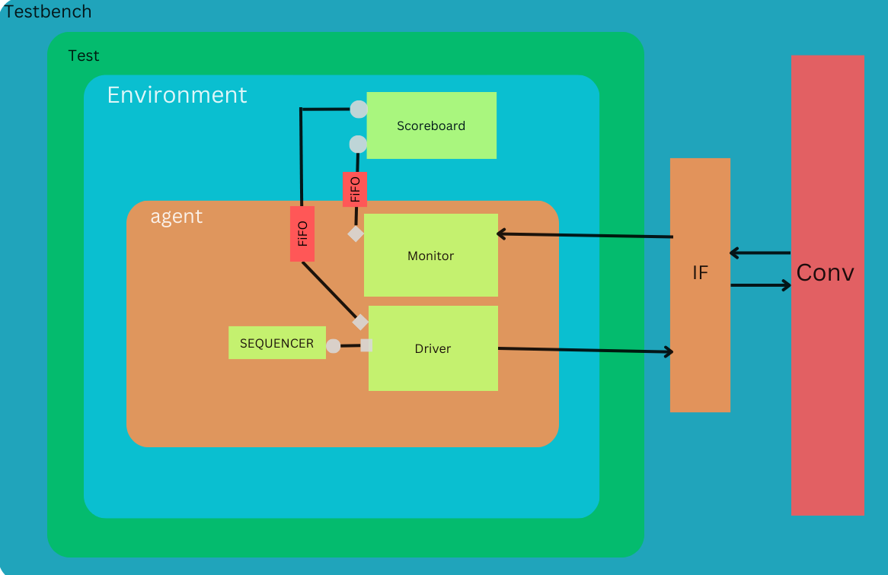

# DUT Verification Environment

This README provides an overview of the verification environment for the Design Under Test (DUT) and instructions on how to use it.

## Overview

This Verification Environment is to Verify the Single Module of Conv. 

## Architecture



This Environment is validating a single instance of the Convolution Module. The verification flow follows a straightforward sequence, encompassing key components: Sequence, Driver, Design Under Test (DUT), Monitor, and Scoreboard.

The verification process is orchestrated as follows:
1. Sequence: High-level sequences define the input stimulus patterns that need to be applied to the DUT for testing.
2. Driver: The Driver component is responsible for transmitting input sequences to the DUT. 
By writing sequence values on the interface.
3. Design Under Test (DUT): This is the core module under verification, where the convolution operation is executed based on the provided input sequences.
4. Monitor: The Monitor observes the output produced by the DUT. It receives this output and facilitates its transfer to the Scoreboard through TLM ports.
5. Scoreboard: The Scoreboard serves as the central verification engine. It features two FIFOs?one receiving inputs from the Driver and the other collecting DUT outputs from the Monitor. The Scoreboard not only stores these inputs but also provides them to a Reference Model. This Reference Model calculates the expected output for comparison.

The verification process unfolds in the Scoreboard, where:
- Inputs received from the Driver and DUT's output from the Monitor are stored in separate FIFOs.
- These stored inputs are simultaneously presented to the Reference Model.
- The Reference Model computes the expected output based on the provided inputs.
- The DUT's output from the Monitor is then compared against the computed expected output from the Reference Model.

This systematic verification approach ensures that the DUT operates as intended, with its output aligned with the reference model's expected behavior, validating the correctness of the Convolution Module.


## Prerequisites

Synopsys VCS

## Installation

Clone this Repo and Run this commad in Repo Folder : 
```bash
make rerun
```

## Results 

After Running the Simulation There will be a output.txt file in same directory and Output will be in that folder and all results of Test(s).
