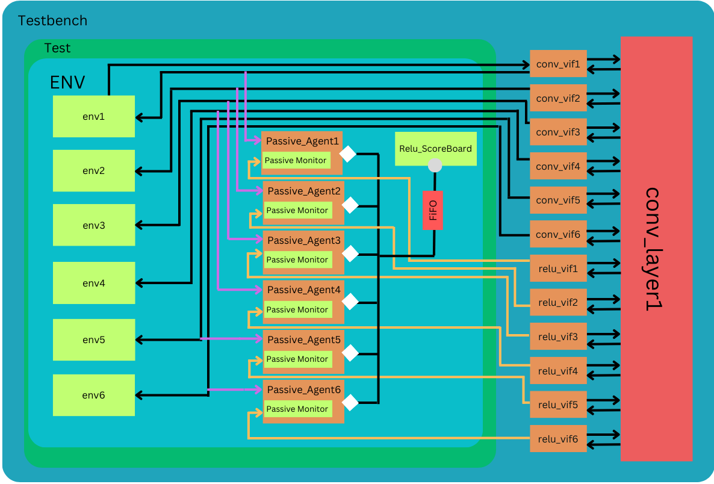

# DUT Verification Environment

This README provides an overview of the verification environment for the Design Under Test (DUT) and instructions on how to use it.

## Overview

This Verification Environment is to Verify the Conv Layer1 which has 6 instances of conv module. 

## Architecture

Within this specific section of our verification process, the Environment deals with a set of six Convolution Modules, all residing in Layer 1 of our design. Additionally, a Rectified Linear Unit (ReLU) operation is applied to their respective outputs. The primary objective here is to maximize efficiency and maintain consistency by utilizing the same Environment for all Convolution Modules. To achieve this, we've created six instances of smaller Environments, effectively crafting a wrapper environment that fulfills our reuse requirement.
In this comprehensive setup, we employ six instances of the following Environment:


Each instance of this Environment encompasses an interface that features both input and output ports. Notably, while the input remains consistent across all Convolution Modules within this layer, the output differs for each. Consequently, we've streamlined our approach by utilizing a single Driver in conjunction with multiple Monitors and Scoreboards. It's worth noting that within this layer, we have two levels of output: the primary Convolution output and the post-ReLU output.
To accommodate this structure seamlessly, we've devised a dedicated temporary interface designed to capture ReLU values. Simultaneously, the remaining six interfaces access the Convolution outputs directly through the DUT's internal signals.
It's important to emphasize that Convolution output validation has already been successfully handled by the Scoreboard within the smaller environments. However, for the ReLU component, we've introduced an additional Scoreboard and 6 Passive Agents. The Passive Agent's Monitor receives the ReLU output, and through TLM (Transaction-Level Modeling) communication, forwards it to the Relu-Scoreboard for rigorous comparison. To facilitate this, we've introduced a new sequence item capable of storing both pre-and post-ReLU outputs, ensuring comprehensive verification.




## Prerequisites

Synopsys VCS

## Installation

Clone this Repo and Run this commad in Repo Folder : 
```bash
make rerun
```

## Results 
After Running the Simulation There will be a output.txt file in same directory and Output will be in that folder and all results of Test(s).
