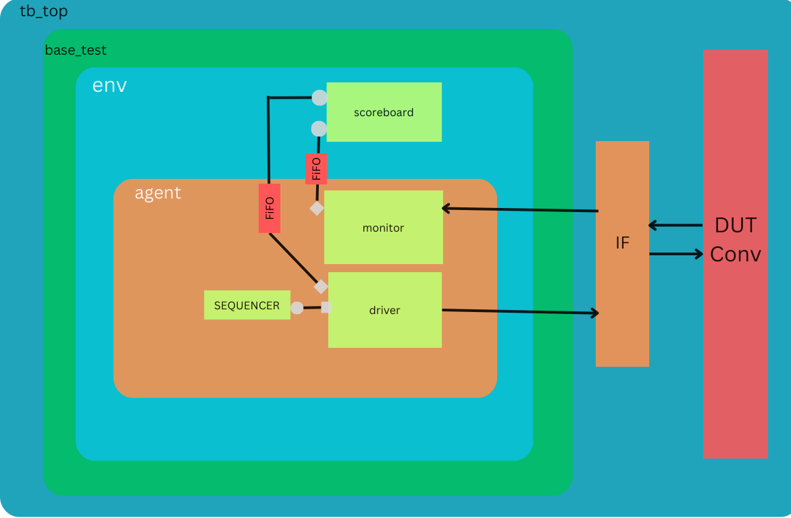

# DUT Verification Environment

This README provides an overview of the verification environment for the Design Under Test (DUT) and instructions on how to use it.

## Overview

This Verification Environment is to Verify the Single Module of Conv. 

## Architecture



Flow of Stimulus is simple as below : 

Sequence ->Driver -> DUT ->Monitor -> Scoreboard

There is a reference model of convolution to verify the answers of Conv.

Driver is sending input to DUT and Scoreboard using TLM ports.

The monitor receives the Output of DUT and then transfers it to the Scoreboard by using TLM ports.

In the Scoreboard there are 2 fifos which will receive Inputs from Driver and DUT Output from Monitor

and then give the same input to the Reference model and receive output from the reference model and compare that with the DUT output.

## Prerequisites

Synopsys VCS

## Installation

Clone this Repo and Run this commad in Repo Folder : 
```bash
make rerun
```

## Results 

After Running the Simulation There will be a output.txt file in same directory and Output will be in that folder and all results of Test(s).
