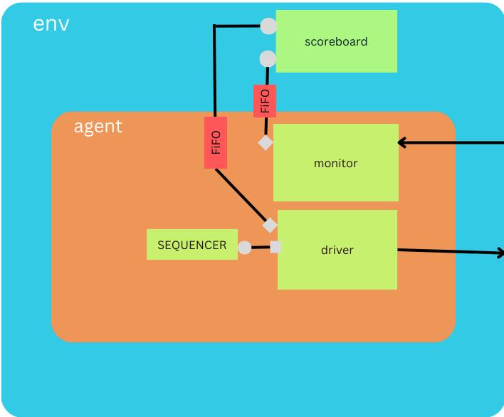
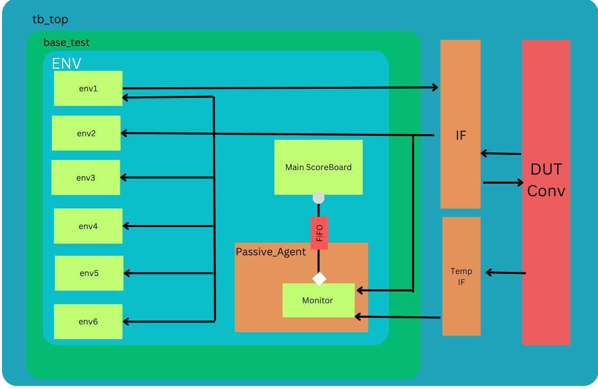

# DUT Verification Environment

This README provides an overview of the verification environment for the Design Under Test (DUT) and instructions on how to use it.

## Overview

This Verification Environment is to Verify the Conv Layer1 which has 6 instances of conv module. 

## Architecture

In this part, there are 6 copies of the conv module in Layer1 and there is Relu Operation on output too. 
The main requirement here is to use the same Environment of the Conv Module and then make 6 instances of Smaller Environments to Make a wrapper environment that will fulfill our requirement of Reusing. 
I Will be using 6 instances of this below environment:



My interface has Input and output in both parts and in this layer, input is the same for all conv modules but the output is different so only one driver will be running along with all monitors and scoreboards. Also, there are 2 levels of output one is the output of conv and the other is after Relu.
So I have designed a separate temporary interface that will get the values of Relu and the other 6 interfaces will be getting conv outputs by accessing direct DUT internal signals.
Conv output is already verified by the scoreboard of smaller environments but for the Relu part I have designed another scoreboard and a passive agent whose monitor will receive Relu output and then through the TLM port it will sent to the main scoreboard for comparison, For this new sequence item is created that can hold with and without Relu outputs. 



## Prerequisites

Synopsys VCS

## Installation

Clone this Repo and Run this commad in Repo Folder : 
```bash
make rerun
```

## Results 
After Running the Simulation There will be a output.txt file in same directory and Output will be in that folder and all results of Test(s).
