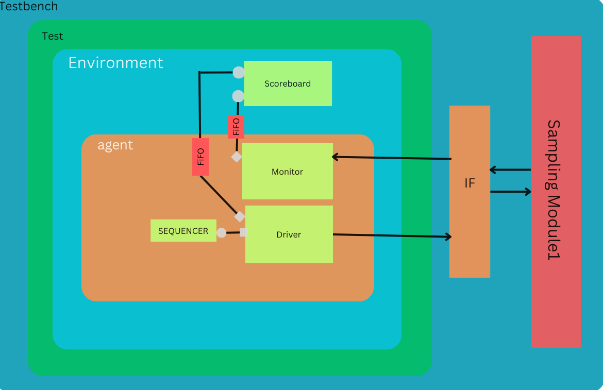

# DUT Verification Environment

This README provides an overview of the verification environment for the Design Under Test (DUT) and instructions on how to use it.

## Overview

This Verification Environment is to Verify the Single Module of Sampling. 

## Architecture



In this verification environment, our primary objective is to validate the functionality of a single instance of the Sampling Module. The verification flow follows a straightforward sequence, encompassing the following stages: Sequence -> Driver -> Device Under Test (DUT) -> Monitor -> Scoreboard.

To ensure the accuracy of our Sampling Module, we employ a reference model for Sampling as our benchmark for verification. This reference model serves as a trusted source for validating the outputs generated by our DUT.

The Driver component transmits input data to the DUT and the Scoreboard, utilizing Transaction-Level Modeling (TLM) ports. This efficient communication method optimizes data transfer within our environment.

The Monitor plays a pivotal role by intercepting the DUT's output and subsequently conveying it to the Scoreboard via TLM ports. This seamless data exchange enables real-time monitoring and validation of the DUT's behavior.

Within the Scoreboard, we've incorporated two First-In-First-Out (FIFO) queues. These FIFOs serve as data buffers, receiving input data from the Driver and the DUT's output from the Monitor. The Scoreboard then synchronizes these inputs and directs them to the Reference Model for evaluation. Subsequently, the Scoreboard retrieves the Reference Model's output and proceeds to compare it against the output generated by the DUT. This meticulous comparison process ensures that our Sampling Module operates as expected and aligns with the Reference Model's behavior.


## Prerequisites

Synopsys VCS

## Installation

Clone this Repo and Run this commad in Repo Folder : 
```bash
make rerun
```

## Results 

After Running the Simulation There will be a output.txt file in same directory and Output will be in that folder and all results of Test(s).
