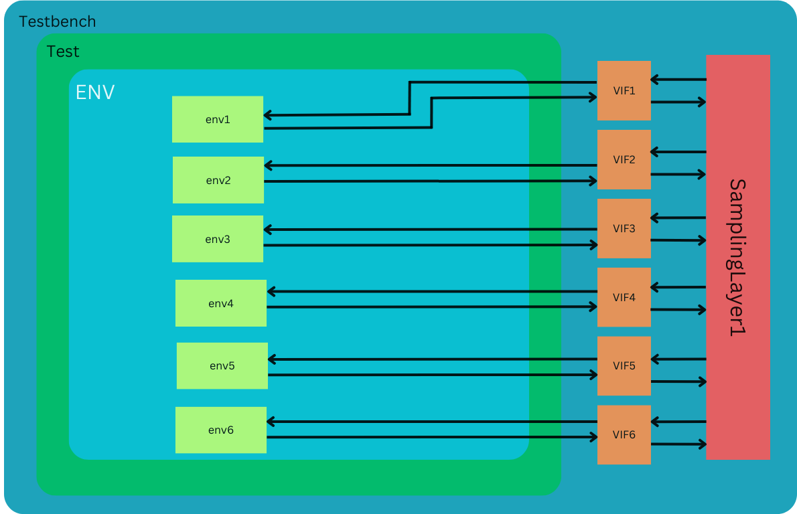

# DUT Verification Environment

This README provides an overview of the verification environment for the Design Under Test (DUT) and instructions on how to use it.

## Overview

This Verification Environment is to Verify the Conv Layer1 which has 6 instances of conv module. 

## Architecture

In this section, the verification process encompasses six instances of the Sampling Module, all residing within Layer 1 of the design hierarchy. The core objective here revolves around leveraging the pre-existing Sampling Module Environment and adapting it to accommodate the testing of these six Sampling Module instances. This strategic endeavor capitalizes on the reusability of the available resources.
I Will be using 6 instances of this below environment:


To execute this strategy, six smaller environments are instantiated, each dedicated to the management of an individual Sampling Module instance. Together, these smaller environments collectively form a wrapper environment, collaboratively addressing our specific testing requirements.
Each instance within this ensemble possesses a distinct interface, featuring unique input and output specifications. The smaller environments meticulously handle these individual differentiations, ensuring precise control and monitoring tailored to each instance's behavior.
The modular design of the verification environment eliminates the necessity for an additional scoreboard, as each smaller environment autonomously manages the monitoring and validation of its respective instance. This streamlined approach optimizes the testing infrastructure, rendering it both scalable and resource-efficient.




## Prerequisites

Synopsys VCS

## Installation

Clone this Repo and Run this commad in Repo Folder : 
```bash
make rerun
```

## Results 
After Running the Simulation There will be a output.txt file in same directory and Output will be in that folder and all results of Test(s).
