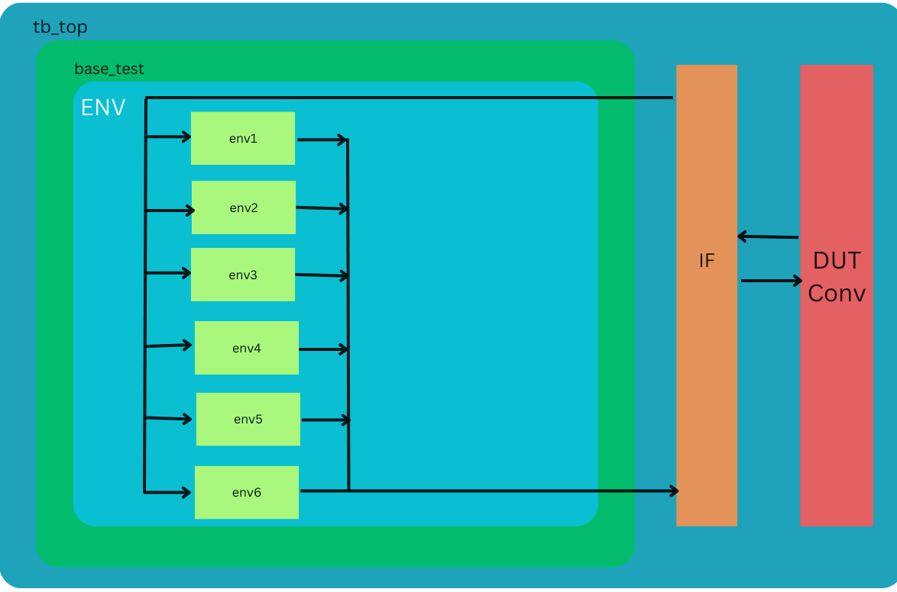

# DUT Verification Environment

This README provides an overview of the verification environment for the Design Under Test (DUT) and instructions on how to use it.

## Overview

This Verification Environment is to Verify the Conv Layer1 which has 6 instances of conv module. 

## Architecture

In this part, there are 6 copies of the sampling module in Layer 1.. 
The main requirement here is to use the same Environment of the Conv Module and then make 6 instances of Smaller Environments to Make a wrapper environment that will fulfill our requirement of Reusing. 
I Will be using 6 instances of this below environment:


My interface has Input and output in both parts and in this layer, inputs and outputs are different for all instances. Every instance is managed by smaller environments and there is no need for any extra scoreboard.



## Prerequisites

Synopsys VCS

## Installation

Clone this Repo and Run this commad in Repo Folder : 
```bash
make rerun
```

## Results 
After Running the Simulation There will be a output.txt file in same directory and Output will be in that folder and all results of Test(s).
